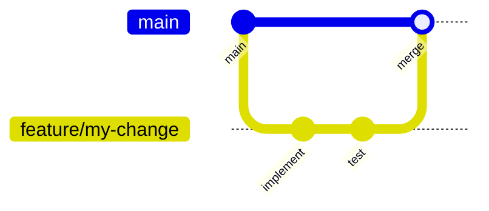
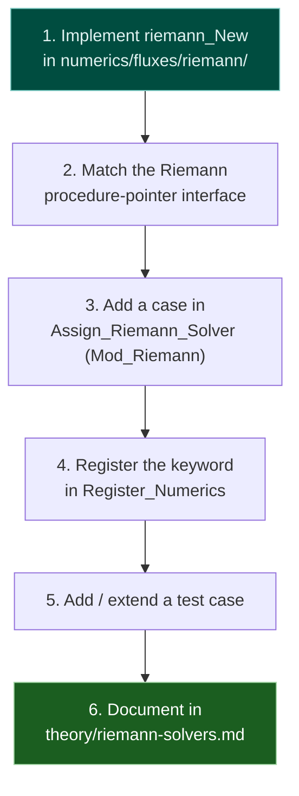
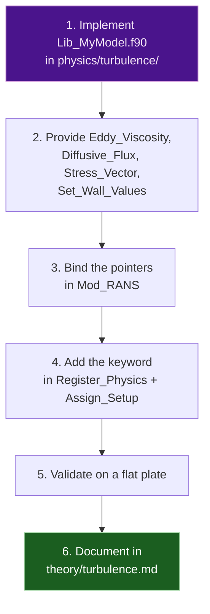

# Contributing

Thank you for your interest in contributing to ARES. This page describes the development workflow, coding conventions, and the patterns for extending the solver.

---

## Development Workflow



1. **Branch** — create a feature branch from `develop` (or `main`).
2. **Implement** — make focused commits.
3. **Test** — run the relevant case(s) and their `validate_*.py` (see [Testing](testing.md)).
4. **Push & PR** — open a pull request.
5. **Review** — address feedback; a maintainer merges when ready.

---

## Setting Up a Development Environment

```bash
# 1. Clone with submodules
git clone https://github.com/open-hydra/ARES.git
cd ARES
./install.sh update

# 2. First build (writes CMakePresets.json)
./install.sh build --compilers=gnu --use-openmp

# 3. Iterative recompilation thereafter
./install.sh compile
```

!!! tip "CMakePresets.json"
    After the first `install.sh build`, subsequent builds only need `./install.sh compile` (or `cmake --build build`), reusing the recorded compiler paths and library locations.

---

## Coding Conventions

### Fortran style

| Rule | Detail |
|------|--------|
| **Kinds** | `iso_fortran_env`: `I4 => int32`, `R8 => real64` |
| **Implicit typing** | Always `implicit none` |
| **Intent** | Declare `intent(in/out/inout)` on every dummy argument |
| **Modules** | One module per file; public module name `ARES_<Name>` |
| **Privacy** | `private` by default; expose with explicit `public ::` |
| **Naming** | `Lib_*` computational routines · `Mod_*` types + pointers · `Wrap_*` driver wrappers · `obj_*` global singletons · `Register_*` registry population |

### Registry-driven input

Every `[ARES-*]` parameter is declared once via `reg%add(section, name, target, default, description, allowed, required)` in a `Register_*` routine (`src/lib/config/`). This single declaration:

- binds the value into its `obj_*` config singleton,
- validates it at run time,
- and is picked up by `DocGen` to (re)generate the [parameter registry](../user/registry.md).

**Add new parameters through the registry — never read raw INI keys ad hoc.** This keeps the documentation and validation in sync with the code.

---

## Adding a New Riemann Solver



The interface (see `riemann_if` in `Mod_Riemann`) receives the left/right primitive states and the face normal and returns the five flux components:

```fortran
subroutine riemann_New(pl,ul,vl,wl,hl, pr,ur,vr,wr,hr, nx,ny,nz, &
                       F_r,F_u,F_v,F_w,F_E)
```

Add the keyword to `Assign_Riemann_Solver`'s `select case (obj_riemann%description)` and to the allowed-values list in `Register_Numerics` so it appears in the registry and is validated.

---

## Adding a New Turbulence Model



A model binds these procedure pointers in `Mod_RANS`:

| Pointer | Purpose |
|---------|---------|
| `Eddy_Viscosity` | Compute $\mu_t$ |
| `RANS_Diffusive_Flux` | Turbulent diffusion of the model variables |
| `Stress_Vector` | Viscous + Reynolds stress on a face |
| `RANS_Set_Wall_Values` | Wall boundary conditions |

Add the model name to the `turbulence-model` allowed list in `Register_Physics` so it is validated and documented.

---

## Layer Boundaries

Respect the separation of layers (see [Code Structure](structure.md)):

- **driver/** calls numerics, physics, and io — never config.
- **numerics/** and **physics/** never call upward into driver.
- **config/** configures numerics/physics but does not call driver.
- **base/** is a leaf with no upward dependencies.

---

## Commit Messages

Use the imperative mood:

```
Add rotated-HLLC carbuncle fix for blunt-body cases

Blend HLLE in the velocity-difference direction with HLLC in the
orthogonal direction. Validated on the hypersonic cylinder.
```
