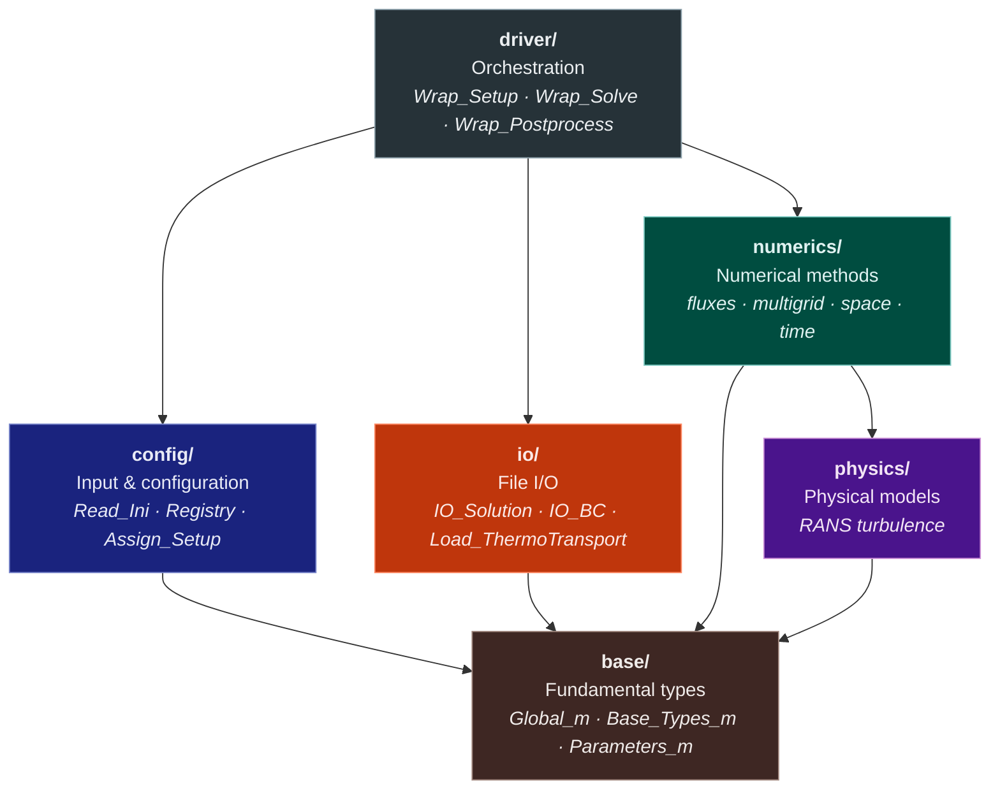
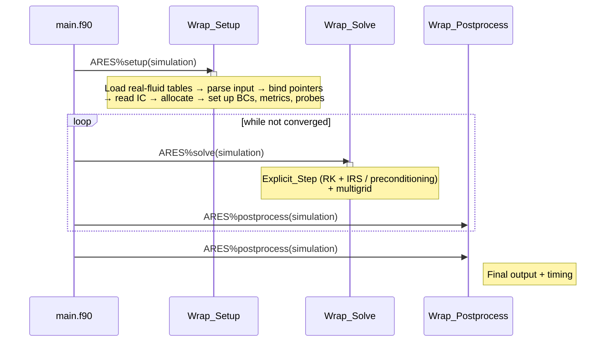

# Code Structure

This page documents the repository layout, the internal architecture of the ARES library, and the solver execution pipeline.

---

## Repository Layout

```
ARES/
├── CMakeLists.txt           # Top-level CMake build
├── CMakePresets.json        # Developer presets (compilers, paths)
├── install.sh               # build / compile / update helper
├── mkdocs.yml               # Documentation site configuration
│
├── src/
│   ├── app/                 # Executables
│   │   ├── main.f90         #   ARES solver entry point
│   │   └── docgen.f90       #   Input-parameter documentation generator
│   ├── lib/                 # ARES library (libARES)
│   │   ├── base/            #   Fundamental types, parameters, globals
│   │   ├── config/          #   Input parsing, registry, setup assignment
│   │   ├── diagnostic/      #   Residual monitoring
│   │   ├── driver/          #   High-level orchestration (Wrap_*)
│   │   ├── io/              #   File I/O (solution, BCs, probes, walls, thermo)
│   │   ├── numerics/        #   Numerical methods
│   │   │   ├── fluxes/      #     convective/diffusive flux, riemann/, bc/
│   │   │   ├── multigrid/   #     restriction / prolongation
│   │   │   ├── space/       #     metrics, reconstruction, limiters, ghosts
│   │   │   └── time/        #     dt + explicit/ (RK, IRS, preconditioning, newstate)
│   │   ├── parallel/        #   MPI / OpenMP communication helpers
│   │   └── physics/         #   Physical models
│   │       ├── turbulence/  #     RANS models (SA, SST, Wilcox, QCR, SSGLRR)
│   │       └── Lib_Prt_Correction.f90
│   └── test/                # Unit-test scaffold (built with BASIC_TEST=ON; currently empty)
│
├── lib/                     # External dependencies (git submodules)
│   ├── FLINT/               #   Real-fluid thermodynamic tables (bundles the OSLO ODE library)
│   ├── ORION/               #   Structured-grid I/O library
│   └── third_party/
│       └── FiNeR/           #   INI file parser
│
├── test/                    # Validation test suite (flat plates, HTD, Prt-correction, common/ tooling)
├── cmake/                   # CMake modules (compiler flags, OpenMP/MPI)
├── bin/                     # Built executables (ARES, DocGen)
└── build/                   # Build artefacts
```

---

## Dependencies

**Required submodules** (always linked, located in `lib/`):

| Library | Purpose |
|---------|---------|
| `FLINT` | Real-fluid thermodynamic & transport tables (ships the OSLO ODE solver library under `lib/FLINT/lib/OSLO`) |
| `ORION` | Structured multi-block grid I/O |
| `FiNeR` | INI file parser |

Optional compile-time dependencies (TecIO, SUNDIALS, Cantera) are enabled via the `install.sh build` flags (`--use-tecio`, `--use-sundials`, `--use-cantera`), which record the corresponding cache variables in `CMakePresets.json` for the submodule builds.

---

## Library Architecture

The ARES library (`libARES`) is organised in layers; lower layers know nothing of higher layers.



---

## Solver Pipeline

`src/app/main.f90` creates an `ARES_type` object and calls three phases: **setup**, **solve** (in a loop), and **postprocess**.



### Explicit step

Each `Explicit_Step` performs one time step:

1. **Compute Δt** — local/global steps from the CFL and VNN conditions (preconditioned signal speed when `prec` is active).
2. **Runge–Kutta loop** (`n_RK` stages):
    - Fill ghost cells (boundary + inter-block).
    - Evaluate convective fluxes (reconstruction → Riemann solver).
    - Evaluate diffusive fluxes.
    - Apply boundary fluxes.
    - Add RANS source terms (if turbulent).
    - Update state via `Newstate` (optional IRS smoothing + RK combination + thermo inversion).
3. **Compute residual** (pressure residual) and write diagnostics.

---

## Convective Flux Evaluation

The convective flux at each interface is built in stages from a 4-point stencil:

1. **Shock detection** (with `MUSCL-SD`) — pressure sensor flags cells near discontinuities.
2. **MUSCL reconstruction** — interface left/right states using the selected limiter.
3. **Riemann solver** — one of six solvers resolves the jump (`Mod_Riemann` binds `Riemann => …`).
4. **Numerical flux** — multiplied by the interface area vector.

---

## RANS Turbulence Models

`Assign_Setup` calls `Setup_RANS_Model` (`Mod_RANS.f90`), which matches the **base name** of `turbulence-model` and binds the implementation to procedure pointers:

| Base name | Library | Description |
|-----------|---------|-------------|
| `laminar`, `none` | — | Viscous Navier–Stokes, no model ($n_{RANS}=0$) |
| `SA` (and `SAcomp`) | `Lib_Spalart` (+ `Lib_SpalartShur`, `Lib_QCR2000`) | Spalart–Allmaras, 1 equation |
| `SST` | `Lib_SST` | Menter $k$–$\omega$ SST (2003), 2 equations |
| `Wilcox2006` | `Lib_Wilcox2006` | Wilcox $k$–$\omega$ (2006), 2 equations |
| `SSGLRR` | `Lib_SSGLRR` | Speziale–Sarkar–Gatski / Launder–Reece–Rodi RSM, 7 equations |

The selection is suffix-based: modifiers are detected with `index()` on the model name and toggle flags in `obj_rans`:

| Suffix / key | Effect |
|--------------|--------|
| `-R` | SA rotation correction (`SAR`) |
| `-RC` | Spalart–Shur rotation–curvature correction |
| `-QCR2000` | Quadratic Constitutive Relation stress (`Stress_Vector_QCR2000`) |
| `-rough` | Sand-grain roughness wall BC (SA only; $k$–$\omega$ models warn and use the smooth-wall $\omega$ BC) |
| `-blowcorr` | Wall-blowing correction of the $k$–$\omega$ wall BC (SST / Wilcox2006) |
| `SAcomp` | SA compressibility correction (Paciorri–Sabetta) |
| `SSGLRR-SD` | SSG-LRR with simple-diffusion model |

The separate `Prt-correction` key (in `[ARES-RANS]`) requires an SA model with `-rough` active, and is calibrated for `Prt = 0.9`.

---

## Riemann Solvers

`Mod_Riemann` binds the `Riemann` procedure pointer from `riemann-solver`:

| Key | Routine | File |
|-----|---------|------|
| `Rusanov` | `riemann_LLF` | `Lib_Riemann_LF.f90` |
| `PLLF` | `riemann_PLLF` | `Lib_Riemann_LF.f90` |
| `HLLE` | `riemann_HLLE` | `Lib_Riemann_HLL.f90` |
| `HLLC` | `riemann_HLLC` | `Lib_Riemann_HLL.f90` |
| `HLLC Prec` | `riemann_HLLCprec` | `Lib_Riemann_HLL.f90` |
| `HLLC Rotated` | `riemann_HLLCrot` | `Lib_Riemann_HLL.f90` |

---

## Data Structures

The top-level `ARES_simulation_type` holds an array of grid levels (one per multigrid level) and an I/O container:

```
ARES_simulation_type
├── domain(:)   ARES_domain_type     — one per multigrid level
│   ├── blk(:)  ARES_block_type      — one per structured block
│   │   ├── P(:,:,:,:)  real64       — primitive variables (p,u,v,w,h,…)
│   │   ├── C(:,:,:,:)  real64       — conservative variables
│   │   ├── R(:,:,:,:)  real64       — residual (flux accumulator)
│   │   └── dtlocal(:,:,:)  real64   — local time step
│   ├── nb      integer              — number of blocks
│   ├── iter    integer              — iteration counter
│   ├── time    real64               — physical time
│   └── dtglobal real64              — global time step
└── IOfield(:)  IOfield_type         — I/O metadata
```

| Array | Shape | Content |
|-------|-------|---------|
| `P` | `(nprim, ni, nj, nk)` | Primitive variables |
| `C` | `(ncons, ni, nj, nk)` | Conservative variables |
| `R` | `(ncons, ni, nj, nk)` | Residual |
| `dtlocal` | `(ni, nj, nk)` | Local time step per cell |

---

## Build System

| Target | Type | Description |
|--------|------|-------------|
| `ARES` (library) | Static library | Core solver; links FLINT, ORION, FiNeR |
| `ARES` (executable) | Executable | Standalone solver (`src/app/main.f90`) |
| `DocGen` | Executable | Input-parameter docs generator (`src/app/docgen.f90`) |

CMake options defined by ARES itself: `USE_OPENMP`, `USE_MPI`, `BASIC_TEST`. The optional-dependency switches (`USE_TECIO`, `USE_SUNDIALS`, `USE_CANTERA`) are consumed by the submodule builds — `install.sh build` writes them all into `CMakePresets.json`. Dependency paths: `ORION_PATH`, `FLINT_PATH`, `OSLO_PATH`, `FINER_PATH` (defaults under `lib/`). The top-level `CMakeLists.txt` only builds the executable when ARES is the top project, so it can be embedded as a sub-directory by the Hydra coupled solver.

---

## Naming Conventions

| Convention | Example | Meaning |
|------------|---------|---------|
| `ARES_` prefix | `ARES_Global_m` | Public Fortran module |
| `obj_` prefix | `obj_sim_param`, `obj_prec` | Global configuration singleton |
| `Lib_` prefix | `Lib_SST` | Computational routine library |
| `Mod_` prefix | `Mod_Riemann` | Module with types + procedure pointers |
| `Wrap_` prefix | `Wrap_Solve` | Driver-level wrapper |
| `Register_` prefix | `Register_Numerics` | Registry population routine |
| `_m` suffix | `Config_Types_m` | Fundamental type module |
| `_type` suffix | `ARES_block_type` | Derived type |

The code name itself is the parameter `codename = 'ARES'` in `Parameters_m.f90`; the INI section prefix (`ARES-Numerics`, …) is built from it, which is also how the **HYDRA** coupling mode re-homes the multigrid section under `HYDRA-Multigrid`.
