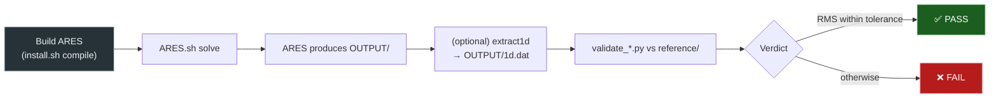

# Testing

ARES ships with a validation test suite that exercises the solver on real-fluid turbulent flows with reference or experimental data. This page describes the test organisation, how to run cases, and how to add new ones.

---

## Test Organisation

```
test/
├── Flat_Plate_SA/          # turbulent flat plate (SA)        — NASA TMR
├── Flat_Plate_SST/         # turbulent flat plate (SST)       — NASA TMR
├── Flat_Plate_Wilcox2006/  # turbulent flat plate (Wilcox06) — NASA TMR
├── Flat_Plate_SGGLRR/      # turbulent flat plate (SSG-LRR)   — NASA TMR
├── HTD/                    # supercritical para-H₂ heat-transfer deterioration
├── Prt-correction/         # turbulent-Prandtl roughness correction (axisymmetric)
└── common/                 # shared validation tooling (extract1d, _fp_turb_common.py)
```

| Case | Verification script | What is checked |
|------|--------------------|-----------------|
| `Flat_Plate_SA/` | `validate_sa.py` | $c_f(\mathrm{Re}_x)$ vs. NASA TMR (from `OUTPUT/1d.dat`) |
| `Flat_Plate_SST/` | `validate_sst.py` | $c_f$ + wall-scaled $k^+$, $\omega^+$ profiles vs. NASA TMR |
| `Flat_Plate_Wilcox2006/` | `validate_wilcox2006.py` | $c_f$ (+ `mut.dat` reference) vs. NASA TMR |
| `Flat_Plate_SGGLRR/` | `validate_sgglrr.py` | $c_f$ (+ `mut.dat` reference) vs. NASA TMR |
| `HTD/` | `reference/validate_htd.py` | Wall / bulk temperature vs. NASA experimental pipe-H₂ data |
| `Prt-correction/` | `validate_Prt_correction.py` | $f_D/f_{D,theo}$ and $\mathrm{Nu}/\mathrm{Nu}_{theo}$ vs. rough-pipe correlations |

See the [V&V section](../vv/index.md) for the worked cases.

### Shared tooling (`test/common/`)

- **`Extract1D.f90`** (built as `extract1d`) — extracts section-averaged 1-D profiles (bulk and wall quantities) from the 2-D Tecplot output, reading the real-fluid tables to reconstruct the thermodynamic state. Usage: `extract1d field.tec wall.tec 1d.dat INPUT_folder`. The `OUTPUT/1d.dat` it produces is what `validate_sa.py`, `validate_htd.py`, and `validate_Prt_correction.py` read.
- **`_fp_turb_common.py`** — shared helpers for the flat-plate scripts (Tecplot BLOCK readers, Reynolds-consistent $c_f$ comparison, NASA-TMR zone selection).

---

## Test Case Structure

Each case is a self-contained directory:

```
Flat_Plate_SST/
├── input.ini          # Solver (+ ATLAS pre-processing) configuration
├── ARES.sh            # Run script (compile / solve / kill)
├── MESH/mesh.tec      # Mesh (committed; generated by the ATLAS [GRIB] blocks)
├── INPUT/             # Case data (phase.txt, thermo/transport tables, ic.*, bc.txt)
├── reference/         # Reference solution data (NASA TMR, experiment, …)
├── validate_*.py      # Verification script (prints stats + PASS/FAIL, shows plots)
└── OUTPUT/            # (created at runtime)
```

| File / dir | Purpose |
|------------|---------|
| `input.ini` | Solver (`[ARES-*]`) + ATLAS (`[GRIB/GPB/ICB/BCB]`) configuration |
| `MESH/` | The case mesh (`mesh.tec`), versioned with the case |
| `INPUT/` | Real-fluid table, initial condition, boundary conditions — generated by ATLAS (not versioned) |
| `reference/` | Reference data (NASA TMR, experimental, …) |
| `validate_*.py` | Reads `OUTPUT/`, compares to `reference/`, prints error metrics and a PASS/FAIL verdict with comparison plots |
| `ARES.sh` | Convenience script (`compile`, `solve [-p N] [-m N] [-b]`, `kill`) |

!!! note "Two layout variants"
    `HTD` keeps its verification script inside `reference/` (`reference/validate_htd.py`, run from within that directory), and `Prt-correction` builds its own constant-property table with `make-ares-table.py` instead of requesting one from ATLAS.

---

## Running a Single Case

```bash
cd test/Flat_Plate_SST

./ARES.sh compile        # build a local bin/ARES from the master build
./ARES.sh solve          # run in foreground
./ARES.sh solve -p 8     # run with 8 OpenMP threads
./ARES.sh solve -m 2 -p 8  # 2 MPI processes × 8 OpenMP threads (hybrid)
./ARES.sh solve -b -p 8  # run in background (stdout → logfile, PID → .ID)
./ARES.sh kill           # kill the background run

python3 validate_sst.py  # verify against the reference
```

`ARES.sh solve` sets `ulimit -s unlimited` and `KMP_STACKSIZE`, creates `OUTPUT/` and `bin/`, copies the freshest binary, and launches it.

---

## Test Workflow



The `extract1d` step is needed by the cases whose script reads `OUTPUT/1d.dat` (`Flat_Plate_SA`, `HTD`, `Prt-correction`); the other flat plates read `field.tec` / `wall.tec` directly.

---

## Adding a New Case

1. Create a directory under `test/`.
2. Provide an `input.ini` with both the `[ARES-*]` solver blocks and the `[GRIB/GPB/ICB/BCB]` pre-processing blocks.
3. Run the solver to generate a solution; save the trusted result (or an external reference) under `reference/`.
4. Write a `validate_*.py` that reads `OUTPUT/field.tec` and `wall.tec` (or `OUTPUT/1d.dat` produced with `common/extract1d`), compares the quantity of interest against `reference/`, and prints the error metrics and a PASS/FAIL verdict. Reuse the helpers in `test/common/_fp_turb_common.py` where possible.
5. Copy `ARES.sh` from a sibling case (it is generic apart from the master path).

!!! tip "Building a custom table"
    A case can build its own real-fluid `(p,h)` table instead of requesting one from ATLAS via `[GPB]`. The `Prt-correction` case does this with `make-ares-table.py`, which writes `thermo.dat` / `transport.dat` / `phase.txt` in the ATLAS format — useful for isolating a single model with constant properties.

---

## Unit Tests

Building with `-DBASIC_TEST=ON` (CMake) compiles every `*.f90` / `*.F90` placed under `src/test/`: each file becomes a standalone executable linked against `libARES` (plus FiNeR, OSlo, ORION), written to `test/basic/<name>/<name>.exe`. The directory currently contains only the CMake scaffold — no unit tests are present; the suite above is validation-level.
