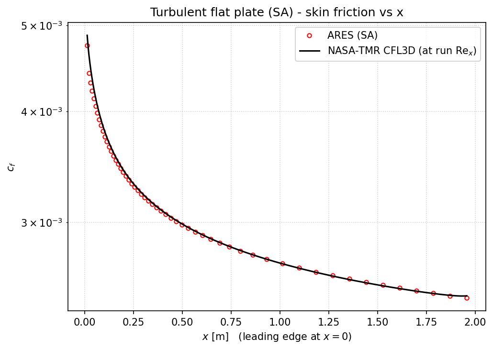
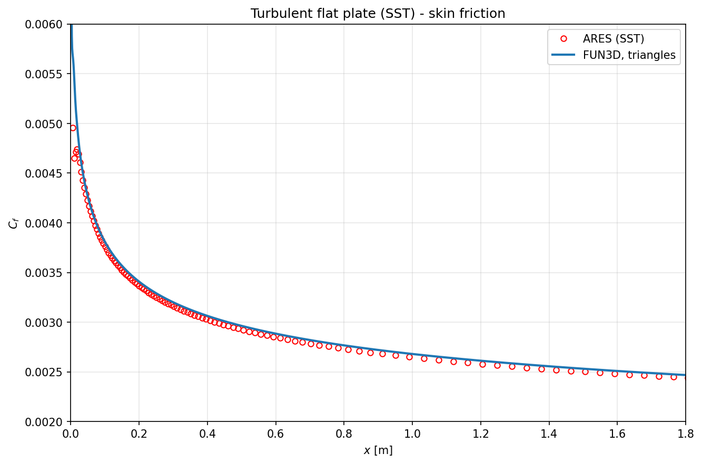
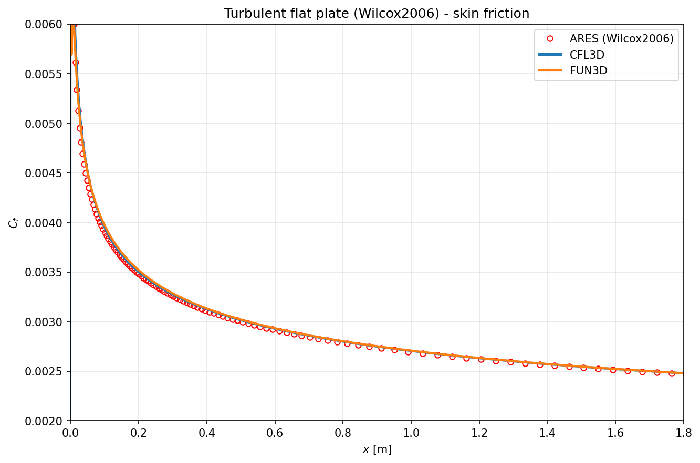
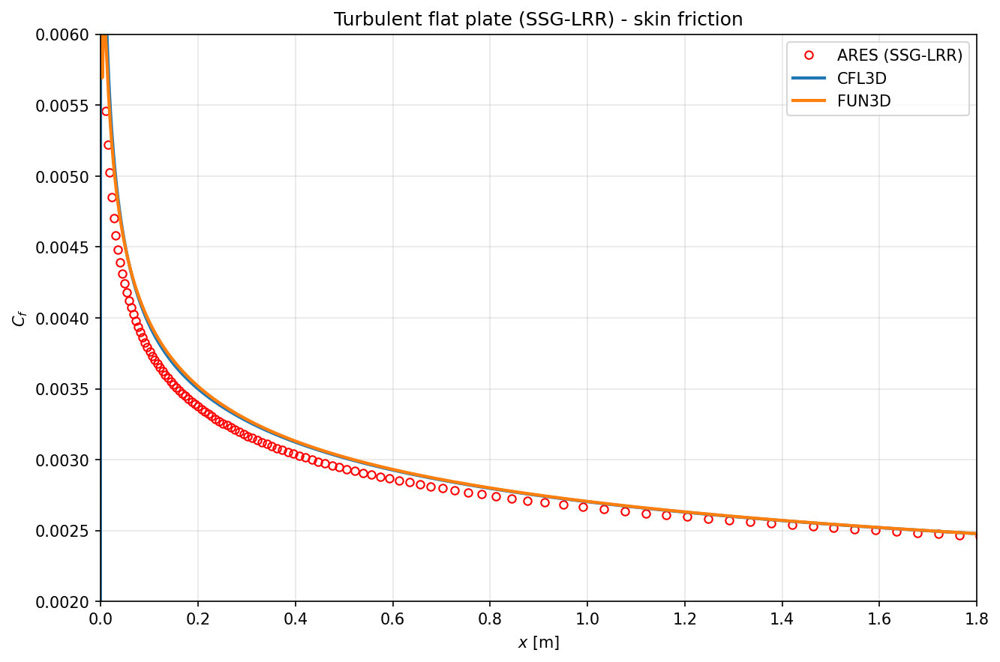
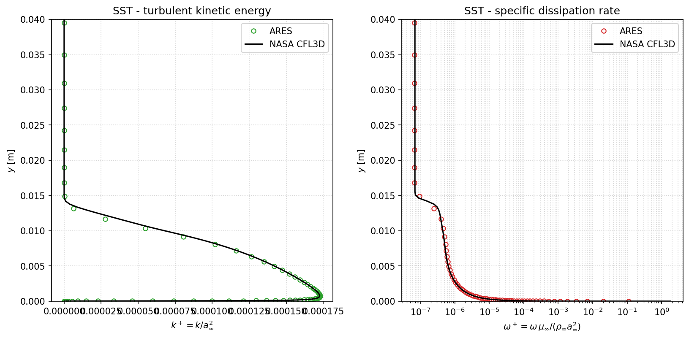
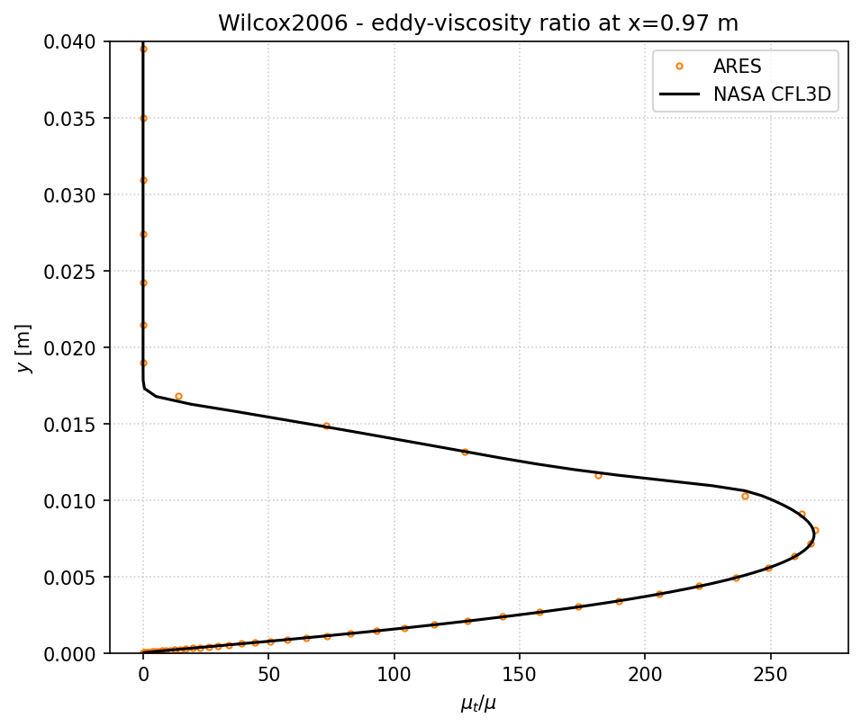

# Turbulent Flat Plate (NASA TMR)

**Cases:** `test/Flat_Plate_SA`, `test/Flat_Plate_SST`, `test/Flat_Plate_Wilcox2006`, `test/Flat_Plate_SGGLRR`

The turbulent flat plate is the standard RANS validation case. ARES is run with each of its turbulence models on the same flow and compared against the **[NASA Turbulence Modeling Resource](https://turbmodels.larc.nasa.gov/) (TMR)** flat-plate reference data.

| Case directory | `turbulence-model` | Verification script | Reference data |
|----------------|--------------------|---------------------|----------------|
| `Flat_Plate_SA` | `SA` | `validate_sa.py` (reads `OUTPUT/1d.dat`) | `cf.dat` |
| `Flat_Plate_SST` | `SST` | `validate_sst.py` | `cf.dat`, `kw.dat`, `mut.dat` |
| `Flat_Plate_Wilcox2006` | `Wilcox2006` | `validate_wilcox2006.py` | `cf.dat`, `mut.dat` |
| `Flat_Plate_SGGLRR` | `SSGLRR` | `validate_sgglrr.py` | `cf.dat`, `mut.dat` |

Running the same geometry through all four models exercises the one-equation, both two-equation, and the Reynolds-stress closures against a common benchmark.

---

## Problem definition

A zero-pressure-gradient turbulent boundary layer over a flat plate, with `simulation-type = turbulent` and a `[ARES-RANS]` block selecting the model. The working fluid is air from a real-fluid $(p,h)$ table; the inflow carries the freestream turbulence values needed by the model — `kappa`/`omega` for the two-equation models, `rhoRij`/`omega` for the RSM, `mit` for SA.

The lower boundary is split into an upstream **symmetry** segment (ahead of the leading edge) and a downstream **adiabatic no-slip wall** (the plate), using the patch mechanism:

```ini
[ARES-Parameters]
simulation-type = turbulent

[ARES-RANS]
turbulence-model = SST     ; or SA / Wilcox2006 / SSGLRR
Prt = 0.85

[wall]
direction = x
patch1 = symmetry   ;  x ∈ [-2, 0]
range1 = -2. 0.
patch2 = adiabatic  ;  x ∈ [0, 2]   (the plate)
range2 = 0. 2.
```

---

## Theory — the turbulent flat-plate boundary layer

The zero-pressure-gradient turbulent boundary layer is the canonical wall-bounded benchmark because its near-wall structure is universal. In wall units, $u^+ = u/u_\tau$ and $y^+ = y\,u_\tau/\nu$ with the friction velocity $u_\tau = \sqrt{\tau_w/\rho}$, the mean velocity follows the **law of the wall**:

$$
u^+ = y^+ \;\;(y^+\lesssim5),
\qquad
u^+ = \frac{1}{\kappa}\ln y^+ + B \;\;(y^+\gtrsim30),
\qquad \kappa=0.41,\; B\approx5.0 .
$$

The quantity under test is the **skin-friction coefficient**, related to the wall shear stress and the local Reynolds number $\mathrm{Re}_x = \rho_\infty U_\infty x/\mu_\infty$:

$$
c_f = \frac{\tau_w}{\tfrac12\rho_\infty U_\infty^2} = 2\left(\frac{u_\tau}{U_\infty}\right)^2,
\qquad
\tau_w = \mu\,\frac{\partial u}{\partial y}\bigg|_{w}.
$$

For an incompressible turbulent boundary layer the skin friction follows the Kármán–Schoenherr / power-law trend $c_f \approx 0.026\,\mathrm{Re}_x^{-1/7}$; the NASA TMR data provide the model-specific reference curve each ARES model is checked against. Because the comparison is made in $\mathrm{Re}_x$ space, the $c_f(\mathrm{Re}_x)$ curve collapses onto the reference independently of the exact run Reynolds number.

---

## Reference quantities

`validate_sst.py` (and its siblings) reproduce the quantities plotted in the case's `PLOT.lay`, comparing against the NASA TMR data in `reference/`:

1. **Skin-friction coefficient** $c_f(x)$ vs. `reference/cf.dat`. Because the run may not sit exactly at the TMR Reynolds number, the comparison is done in $\mathrm{Re}_x$ space.
2. **Turbulence profiles** at $x \approx 0.97$ vs. `reference/kw.dat`, in wall-scaled form:

$$
k^+ = \frac{k}{a_\infty^2},
\qquad
\omega^+ = \frac{\omega\,\mu_\infty}{\rho_\infty a_\infty^2}.
$$

!!! note "Reynolds consistency"
    The $c_f(\mathrm{Re}_x)$ curve collapses onto the reference regardless of the exact run Reynolds number, but the $x\approx0.97$ profiles only collapse if the run is at the TMR Reynolds number ($\mathrm{Re}=5\times10^{6}$). The verification scripts document this so a profile mismatch is not misread as a model error.

---

## Solution variables

The turbulent `field.tec` carries the real-fluid primitive set plus the model and derived quantities:

```
x y z (nodal) | p u v w h kappa omega T rho sound mil kl mit (cell-centred)
```

where `kappa` = $k$, `omega` = $\omega$, `mil` = $\mu_\ell$, `kl` = $k_\ell$, `mit` = $\mu_t$. Wall output (`wall.tec`) provides the skin friction used for $c_f$.

---

## Running and verifying

### Step 1 — generate the constant-property tables

The NASA-TMR reference is a **calorically simple gas**, so before running `Flat_Plate_SST`, `Flat_Plate_Wilcox2006` or `Flat_Plate_SGGLRR` you must **run the bundled Python scripts that flatten the real-fluid $(p,h)$ table to constant properties**. They overwrite the case's `INPUT` tables in place:

```bash
cd test/Flat_Plate_SST
python3 set_constant_cp.py          # thermo.dat   -> constant c_p  (so Pr = mu c_p/k = 0.72)
python3 set_constant_transport.py   # transport.dat -> constant mu, k (so Re/m = g/mu = 5e6)
```

- `set_constant_cp.py` replaces only the $c_p$ block of `thermo.dat`, fixing the laminar Prandtl number at the TMR value $\mathrm{Pr}=\mu c_p/k = 0.72$ while leaving the EOS ($\rho,T,a,\dots$) untouched.
- `set_constant_transport.py` replaces the viscosity and conductivity blocks of `transport.dat` with constants, putting the run at the reference unit Reynolds number $\mathrm{Re}/m = g/\mu = 5\times10^{6}$ instead of the real-fluid $\sim2\times10^{6}$.

Without this step the run sits at a different Reynolds number and carries real-fluid property variation, so the wall-scaled profiles would not collapse onto the reference (each script backs up the original to `*.orig`, restore with `cp INPUT/thermo.dat.orig INPUT/thermo.dat`).

### Step 2 — solve and validate

```bash
./ARES.sh solve -p 4
python3 validate_sst.py
```

The script reads `OUTPUT/field.tec` and `OUTPUT/wall.tec`, computes $c_f(x)$ and the wall-scaled $k^+,\omega^+$ profiles, overlays them on the NASA TMR reference, and prints the RMS / max relative $c_f$ error with a **PASS/FAIL** verdict (PASS for RMS < 5 %). The shared comparison logic lives in `test/common/_fp_turb_common.py`.

The **SA** case is the exception — it does **not** need the constant-property scripts, because `validate_sa.py` compares $c_f$ in $\mathrm{Re}_x$ space (so the curve collapses at any Reynolds number). It validates $c_f$ from `OUTPUT/1d.dat`, which must first be generated with the shared extractor:

```bash
cd test/Flat_Plate_SA
../common/extract1d OUTPUT/field.tec OUTPUT/wall.tec OUTPUT/1d.dat INPUT
python3 validate_sa.py
```

---

## Results

The verification scripts overlay the ARES solution (red symbols) on the NASA TMR reference curves and save the figures into each case's `reference/` folder.

### Skin friction $c_f(x)$

Each of the four models produces its own `reference/cf.png`. They are shown together below — the one-equation, both two-equation, and the Reynolds-stress closures are all but indistinguishable from the NASA-TMR reference.

<div class="grid" markdown>









</div>

*Skin-friction coefficient along the plate (ARES red points; NASA-TMR reference lines). Top row: `Flat_Plate_SA/reference/cf.png` (left — the NASA-TMR CFL3D curve is re-expressed at the run's own $\mathrm{Re}_x$, hence the log axis and reach to $x=2$ m) and `Flat_Plate_SST/reference/cf.png` (right). Bottom row: `Flat_Plate_Wilcox2006/reference/cf.png` (left) and `Flat_Plate_SGGLRR/reference/cf.png` — the SSG-LRR Reynolds-stress model (right). Every model holds the reference $c_f(x)$ from the leading edge to the trailing edge with RMS error below 5 %.*

### Turbulence profiles (SST)

{ width="820" }

*`test/Flat_Plate_SST/reference/kappa.png`.* Wall-normal profiles of the non-dimensional turbulence kinetic energy $k^+=k/a_\infty^2$ (left) and specific dissipation rate $\omega^+=\omega\mu_\infty/(\rho_\infty a_\infty^2)$ (right) at the NASA station $x\approx0.97$ m. These profiles only collapse onto the reference because the constant-property tables put the run at the TMR Reynolds number $\mathrm{Re}=5\times10^6$ (Step 1 above).

### Eddy-viscosity ratio (Wilcox 2006)

{ width="600" }

*`test/Flat_Plate_Wilcox2006/reference/mut.png`.* Eddy-viscosity ratio $\mu_t/\mu$ across the boundary layer at $x\approx0.97$ m. The ARES profile (orange) reproduces the NASA CFL3D peak of $\mu_t/\mu\approx 265$ near $y\approx0.008$ m.

### Reynolds-stress closure (SSG-LRR)

`Flat_Plate_SGGLRR` runs the same plate with the seven-equation **SSG-LRR Reynolds-stress model** — the six Reynolds stresses $R_{ij}$ (`ruu, rvv, rww, ruv, ruw, rvw`) plus $\omega$ — instead of an eddy-viscosity closure. `validate_sgglrr.py` checks the skin friction $c_f(x)$ (the SSG-LRR panel in the skin-friction grid above): the RSM holds the NASA-TMR CFL3D/FUN3D curve to within the 5 % RMS tolerance, confirming that the Reynolds-stress transport, its near-wall treatment, and the symmetry boundary condition on the leading-edge segment are all correct.

Unlike SST and Wilcox 2006, the SSG-LRR case does **not** ship a wall-normal profile figure: its $\mu_t/\mu$ peak scales with the run Reynolds number, so it is only meaningful exactly at $\mathrm{Re}=5\times10^6$ and the plot was intentionally removed (the validation reduces to the Reynolds-consistent $c_f$ check).

---

## What this validates

- Each RANS model reproduces the reference skin-friction law of the flat-plate boundary layer.
- The near-wall behaviour of $k$ and $\omega$ (or $\tilde\nu$, or the Reynolds stresses $R_{ij}$) matches the established reference profiles.
- The wall-output machinery (skin friction, $y^+$) is correct.
