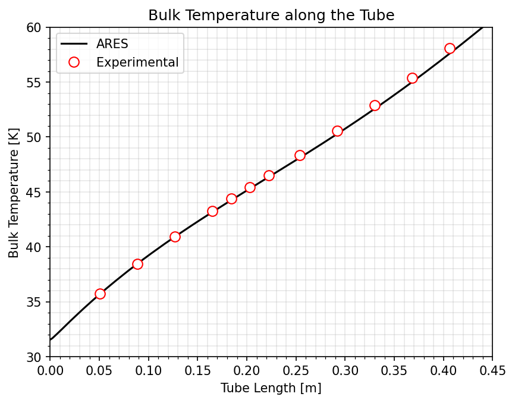
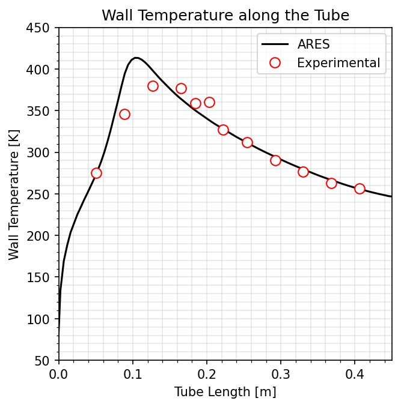

# Supercritical Heat Transfer (HTD)

**Case:** `test/HTD`

This case simulates **heat-transfer deterioration (HTD)** of **supercritical para-hydrogen** flowing through a heated pipe — the flagship real-fluid validation in the suite. Near the pseudo-critical point the properties of hydrogen vary so steeply with enthalpy that the wall heat transfer can *deteriorate*, producing a localised spike in wall temperature. Reproducing that spike requires the full real-fluid equation of state, which is exactly what ARES provides.

---

## Why this case matters

HTD is a stringent test because it stacks the distinguishing ARES features:

| Feature | Activated by |
|---------|--------------|
| Real-fluid EOS over a wide range | `[GPB] fluid = parahydrogen`, $p\in[30,80]$ bar, $T\in[25,800]$ K, $800\times800$ table |
| Low-Mach preconditioning | `integration-variables = prec`, `riemann-solver = HLLC Prec`, `preconditioning-Uref = 600` |
| Wall heating | a heated-wall boundary (`q = 4.766` MW/m²) on the downstream block |
| Multi-block, axisymmetric | `type = 2Daxi`, two blocks joined by a `connection` |

---

## Physical background — supercritical heat transfer

### The pseudo-critical point

Above the thermodynamic critical point ($p>p_c$, $T>T_c$) a fluid is a single phase, but it still passes through a sharp — yet continuous — transition between a *liquid-like* and a *gas-like* state. At a given supercritical pressure this transition is centred on the **pseudo-critical temperature** $T_{pc}(p)$, defined as the temperature at which the isobaric specific heat peaks:

$$
c_p\bigl(p,\,T_{pc}\bigr) = \max_T c_p(p,T),
\qquad
c_p = \left.\frac{\partial h}{\partial T}\right|_p .
$$

For **para-hydrogen** the critical point is $p_c \approx 1.286$ MPa ($\approx 12.86$ bar) and $T_c \approx 32.94$ K. This case runs at $p \approx 46$ bar, i.e. a reduced pressure $p_r = p/p_c \approx 3.6$ — firmly supercritical. Across $T_{pc}$ the density falls by roughly an order of magnitude while $c_p$, the conductivity $k$ and the viscosity $\mu$ all vary steeply. This is precisely the property variation the real-fluid $(p,h)$ table (see [Real-Fluid Thermodynamics](../theory/thermo.md)) is built to capture, and a Newton-inverted ideal-gas EOS cannot.

### Bulk enthalpy and temperature along the tube

For a tube of diameter $D$ with a uniform wall heat flux $q_w$ and mass flux $G = \dot m / A = \rho U$, a one-dimensional energy balance, $\dot m\, dh_b = q_w\,(\pi D\, dx)$, gives the **bulk (mixed-mean) enthalpy**:

$$
\frac{dh_b}{dx} = \frac{q_w\,\pi D}{\dot m} = \frac{4\,q_w}{G\,D},
\qquad
h_b(x) = h_{in} + \frac{4\,q_w}{G\,D}\,x .
$$

The bulk temperature $T_b(x)$ then follows by inverting the real-fluid table at the local $(p,\,h_b)$. While $h_b$ traverses the pseudo-critical enthalpy $h_{pc}=h(p,T_{pc})$, the large $c_p$ holds $T_b$ nearly flat — this is the gentle bulk-temperature curve in the validation plot.

### Heat-transfer coefficient and deterioration

The wall heat flux is tied to the wall-to-bulk temperature difference through the local heat-transfer coefficient $h_c$ and Nusselt number:

$$
q_w = h_c\,(T_w - T_b),
\qquad
Nu = \frac{h_c\,D}{k_b}.
$$

**Heat-transfer deterioration (HTD)** is a localized *collapse* of $h_c$ — equivalently, at fixed $q_w$, a *spike* in the wall temperature $T_w$ — that appears when the near-wall fluid is heated past $T_{pc}$ while the bulk is still liquid-like. The near-wall density drop thickens the thermal layer, accelerates the flow, and distorts the turbulent shear through the strong property gradients, suppressing the near-wall turbulent mixing. The onset is controlled chiefly by the **heat-flux-to-mass-flux ratio** $q_w/G$: above a threshold the wall temperature overshoots. Reproducing the $T_w(x)$ peak therefore stresses the full coupling of the real-fluid EOS, the turbulence model, and the [low-Mach preconditioned](../theory/preconditioning.md) scheme at once.

---

## Configuration

```ini
[ARES-Parameters]
simulation-type = turbulent

[ARES-Numerics]
cfl                     = 0.3
vnn                     = 0.3
time-scheme             = RK3
integration-variables   = prec
riemann-solver          = HLLC Prec
preconditioning-Uref    = 600.0
preconditioning-eps-min = 0.1

[ARES-RANS]
turbulence-model = SA
Prt = 0.9

[GPB-Phase1]
type  = real-fluid
name  = parahydrogen
fluid = parahydrogen
pmin  = 30.0e5    ; minimum pressure [Pa]
pmax  = 80.0e5    ; maximum pressure [Pa]
Tmin  = 25.0e0    ; minimum temperature [K]
Tmax  = 800.0e0   ; maximum temperature [K]
NP    = 800       ; pressure grid points
NH    = 800       ; enthalpy grid points
```

The geometry is a two-block axisymmetric pipe: an **adiabatic entrance** block develops the flow, and a **heated** block applies the wall heat flux. The cryogenic supercritical inflow and the high back pressure are:

```ini
[inflow]
type = inlet
g    = 2741.0      ; mass flux [kg/m²s]
T    = 31.39       ; inlet temperature [K]  (cryogenic)

[outflow]
type = outlet
p    = 46.11d5     ; back pressure [Pa]  (above the H₂ critical pressure ≈ 12.8 bar)
```

!!! note "Genuinely supercritical"
    At ~46 bar and ~31 K the hydrogen is above its critical pressure and temperature, so it is a single supercritical phase whose density and specific heat change by an order of magnitude across the heated section. This is the regime the real-fluid table is built for.

---

## Reference data and verification

The verification script is `reference/validate_htd.py`. The experimental reference is **NASA TN D-3095** (Hendricks, Graham, Hsu & Friedman, *Experimental heat-transfer results for cryogenic hydrogen flowing in tubes at subcritical and supercritical pressures to 800 psia*), **run 24-1027** — measured **bulk temperature** and **wall temperature** at twelve axial stations along the heated tube, embedded directly in the script. The data are reported in Rankine and inches and converted to SI inside the script ($T[\mathrm{K}] = \tfrac59\,T[^{\circ}\mathrm{R}]$, $x[\mathrm{m}] = 0.0254\,x[\mathrm{in}]$).

The script reads:

| Input | Content |
|-------|---------|
| `OUTPUT/1d.dat` | Section-averaged 1-D profiles ($x$, $T_w$, $T$, …) extracted from the 2-D solution |
| `INPUT/thermo.dat` | The $(p,h)$ table, used for the optional bulk-temperature cross-check |

`OUTPUT/1d.dat` is produced by the shared **`extract1d`** tool (`test/common/Extract1D.f90`), which extracts wall and bulk 1-D profiles from `field.tec` / `wall.tec` using the real-fluid tables:

```bash
cd test/HTD
./ARES.sh solve -b -p 8                                          # long run; iter-threshold = 6,000,000
../common/extract1d OUTPUT/field.tec OUTPUT/wall.tec OUTPUT/1d.dat INPUT
cd reference && python3 validate_htd.py                          # overlays ARES on the NASA data
```

The script plots the bulk- and wall-temperature distributions along the tube against the experimental points; the HTD wall-temperature peak in the heated section is the feature under test.

---

## Results

`validate_htd.py` overlays the ARES profiles (black line) on the NASA TN D-3095 measurements (red circles) and writes the figures into `test/HTD/reference/`.

### Bulk temperature

{ width="600" }

*`test/HTD/reference/Tbulk.png`.* Mixed-mean (bulk) temperature along the heated tube. It rises smoothly from the cryogenic inlet (~31 K) as the wall heat flux adds enthalpy, following $h_b(x)=h_{in}+\tfrac{4q_w}{GD}x$ (then inverted on the real-fluid table). The agreement with the twelve experimental stations is essentially exact — a direct check that the $(p,h)$ table and the energy balance are consistent.

### Wall temperature — the HTD peak

{ width="600" }

*`test/HTD/reference/Twall.png`.* Wall temperature along the tube. The sharp **peak near $x\approx0.1$ m** ($T_w\approx410$ K) is the **heat-transfer deterioration**: where the near-wall fluid crosses the pseudo-critical line the local heat-transfer coefficient collapses and, at fixed wall heat flux, $T_w$ overshoots before recovering downstream. ARES reproduces both the location and the height of the peak, which is the headline result of the case — it can only be captured with the full real-fluid EOS.

---

## What this validates

- The **real-fluid $(p,h)$ table and thermo inversion** under steep property variation near the pseudo-critical line.
- The **low-Mach preconditioned** scheme on a genuine internal flow.
- The wall-heating boundary condition and the model's ability to capture the **wall-temperature peak** characteristic of heat-transfer deterioration.

!!! warning "Long run"
    HTD is a deep-convergence case (`iter-threshold = 6,000,000`, `cfl = 0.3`). Run it in the background and monitor `logfile`.

---

## References

1. R. C. Hendricks, R. W. Graham, Y. Y. Hsu, R. Friedman, *Experimental heat-transfer results for cryogenic hydrogen flowing in tubes at subcritical and supercritical pressures to 800 pounds per square inch absolute*, **NASA TN D-3095**, NASA Lewis Research Center, 1966 — [NTRS 19660011645](https://ntrs.nasa.gov/citations/19660011645). *(experimental reference, run 24-1027)*
2. J. D. Jackson, "Fluid flow and convective heat transfer to fluids at supercritical pressure," *Nucl. Eng. Des.* 264 (2013) 24–40 — DOI: [10.1016/j.nucengdes.2012.09.040](https://doi.org/10.1016/j.nucengdes.2012.09.040). *(heat-transfer deterioration review)*
3. I. H. Bell, J. Wronski, S. Quoilin, V. Lemort, "Pure and pseudo-pure fluid thermophysical property evaluation and the open-source thermophysical property library CoolProp," *Ind. Eng. Chem. Res.* 53 (2014) — DOI: [10.1021/ie4033999](https://doi.org/10.1021/ie4033999). *(reference para-hydrogen properties)*
