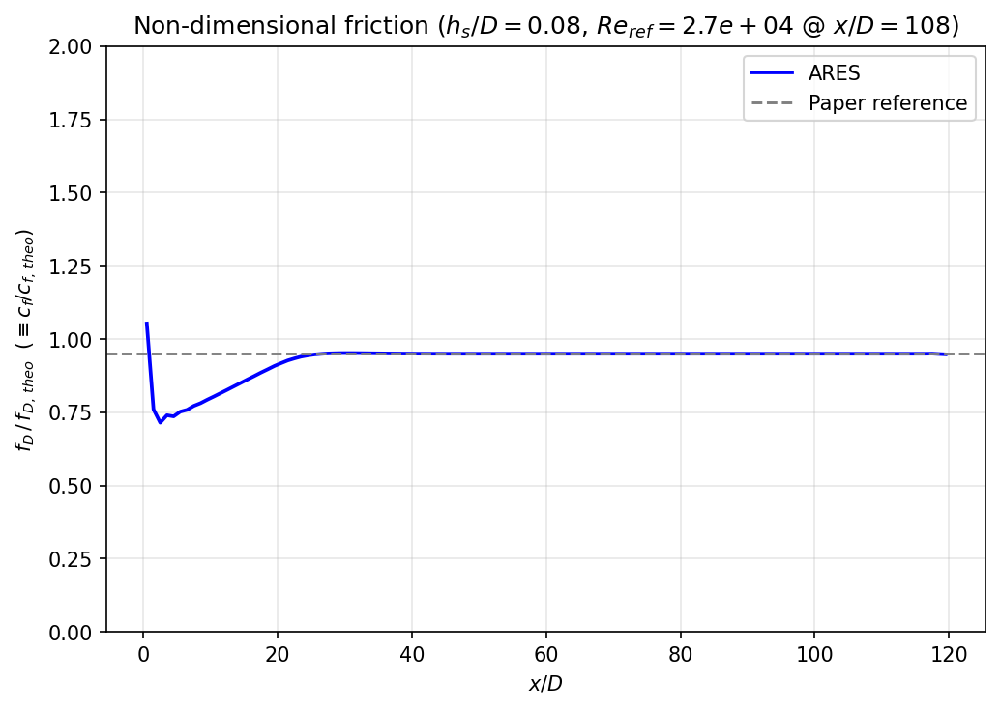
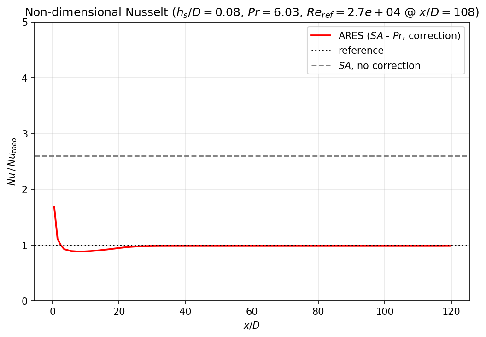

# Turbulent Prandtl Correction

**Case:** `test/Prt-correction`

This case validates the **wall-roughness turbulent-Prandtl correction** — the model in `src/lib/physics/Lib_Prt_Correction.f90`. Physically, a rough wall enhances momentum transfer more than heat transfer, so a constant turbulent Prandtl number $\mathrm{Pr}_t$ over-predicts the wall heat flux on rough surfaces. The correction adds a roughness-dependent increment $\Delta\mathrm{Pr}_t$ near the wall; this case isolates and verifies that effect on a heated, axisymmetric, rough pipe.

---

## Physical background — heat transfer on rough walls

### Turbulent heat flux and the Reynolds analogy

RANS closes the turbulent heat flux with a gradient-diffusion hypothesis governed by a **turbulent Prandtl number** $\mathrm{Pr}_t$, which enters the [effective conductivity](../theory/thermo.md#transport-properties):

$$
-\rho\,\overline{u_j' T'} = \frac{\mu_t\,c_p}{\mathrm{Pr}_t}\,\frac{\partial T}{\partial x_j},
\qquad
\kappa = k_\ell + \frac{\mu_t\,c_p}{\mathrm{Pr}_t}.
$$

A constant $\mathrm{Pr}_t \approx 0.9$ ties heat transfer rigidly to momentum transfer — the **Reynolds analogy**.

### Why roughness breaks the analogy

The *equivalent sand-grain* approach (used by the `SA-rough` model) represents a rough wall as a downward shift $\Delta U^+$ of the logarithmic law of the wall:

$$
u^+ = \frac{1}{\kappa}\ln y^+ + B - \Delta U^+\!\bigl(h_s^+\bigr),
\qquad
h_s^+ = \frac{u_\tau\,h_s}{\nu},
$$

where $h_s$ is the sand-grain height and $u_\tau=\sqrt{\tau_w/\rho}$ the friction velocity. Roughness elements augment momentum transfer through **form drag**, but heat must still cross the viscous sublayer by conduction — there is no pressure-drag shortcut for heat. Momentum is therefore enhanced *more* than heat, and a constant $\mathrm{Pr}_t$ **over-predicts** the wall heat flux, increasingly so with the relative roughness $h_s/D$.

### The turbulent-Prandtl correction (THRC)

ARES restores the imbalance by adding a near-wall, roughness-dependent increment to the turbulent Prandtl number (the thermal high-roughness correction of Latini, Fiore & Nasuti):

$$
\mathrm{Pr}_t = \mathrm{Pr}_{ts} + \Delta\mathrm{Pr}_t,
\qquad
\Delta\mathrm{Pr}_t = \bigl(a\,\Delta U^{+2} + b\,\Delta U^+\bigr)\,e^{-y_n/h_s},
$$

with the roughness log-shift built from the SA working variable $\tilde\nu$ and the wall distance $y_n$:

$$
\Delta U^+ = \frac{1}{\kappa}\ln\!\left(1 + \frac{\tilde\nu\,h_s}{\kappa\,\nu\,n_k\,(y_n + 0.03\,h_s)}\right),
\qquad
n_k = e^{1.3325},
$$

and coefficients that depend on the local molecular Prandtl number $\mathrm{Pr}=\mu_\ell c_p/k_\ell$:

$$
a = a_1\mathrm{Pr}^2 + a_2\mathrm{Pr} + a_3,
\qquad
b = b_1\mathrm{Pr}^2 + b_2\mathrm{Pr} + b_3.
$$

| Coefficient | Value | Coefficient | Value |
|:-----------:|:-----:|:-----------:|:-----:|
| $a_1$ | $-2.346\times10^{-4}$ | $b_1$ | $-2.303\times10^{-3}$ |
| $a_2$ | $\phantom{-}2.102\times10^{-3}$ | $b_2$ | $\phantom{-}5.588\times10^{-2}$ |
| $a_3$ | $\phantom{-}3.542\times10^{-3}$ | $b_3$ | $-3.043\times10^{-3}$ |

Here $\kappa=0.41$ is the von Kármán constant, $n_k=e^{1.3325}$ the Nikuradse constant, and $\mathrm{Pr}_{ts}=0.9$ the smooth-wall value. The factor $e^{-y_n/h_s}$ confines the correction to within a few roughness heights of the wall; the increment **raises** $\mathrm{Pr}_t$ there, **lowers** the turbulent conductivity $\kappa_t=\mu_t c_p/\mathrm{Pr}_t$ and hence the wall heat flux — breaking the Reynolds analogy by exactly the amount the rough-wall data demand. On a smooth wall ($h_s\to0$) the shift $\Delta U^+\to0$ and $\Delta\mathrm{Pr}_t\to0$, recovering the standard constant $\mathrm{Pr}_t$.

### Where the increment is evaluated

$\Delta\mathrm{Pr}_t$ is formed **per face**, from the local state, everywhere the effective conductivity is assembled — but the two kinds of face are treated differently:

| Face | SA variable | $y_n$ | Source |
|---|---|---|---|
| Interior | interface value $\tilde\nu$ | wall distance of the interface | `src/lib/numerics/fluxes/Lib_Diffusive.f90` |
| Wall | wall value $\tilde\nu_w$ from the rough-wall BC | $0$ | `src/lib/numerics/fluxes/bc/Lib_BC_Fluxes_Wall_Heat.f90`, `…_Wall_Temperature.f90` |

The two are consistent because the Aupoix–Spalart rough-wall condition is the discrete form of $\tilde\nu=\kappa u_\tau\,(y+0.03\,h_s)$. Evaluating that relation at the wall and at the first cell centre $y_c$ returns the *same* friction velocity,

$$
\frac{\tilde\nu_w}{\kappa\,(0 + 0.03\,h_s)}
\;=\;
\frac{\tilde\nu_c}{\kappa\,(y_c + 0.03\,h_s)}
\;=\; u_\tau ,
$$

so the pairs $(\tilde\nu_w,\,y_n{=}0)$ and $(\tilde\nu_c,\,y_n{=}y_c)$ give an identical $\Delta U^+$. What does *not* transfer is the damping factor. A wall flux is computed on the wall face itself, where the exponential must be $e^{0}=1$ — its undamped value. Feeding the first-cell distance there instead would scale the wall correction by $e^{-y_c/h_s}<1$ and systematically under-predict it: harmless on a wall-resolved mesh with $y_c \ll h_s$, but increasingly wrong as the first cell grows toward the roughness height.

!!! warning "Calibration envelope"
    The coefficients above were fitted at $\mathrm{Pr}=0.98$, $2.44$ and $6.033$ only, and the polynomial $a(\mathrm{Pr})$ changes sign at $\mathrm{Pr}=10.41$. Well outside that range the increment can turn negative and drive $\mathrm{Pr}_{ts}+\Delta\mathrm{Pr}_t$ toward zero. The model is also calibrated for the **fully rough** regime ($h_s^+>68$) on circular cross-sections with near-constant properties.

---

## Configuration

```ini
[ARES-Parameters]
simulation-type = turbulent

[ARES-Numerics]
cfl                     = 0.2
vnn                     = 0.2
time-scheme             = RK2
integration-variables   = prec
riemann-solver          = HLLC Prec
preconditioning-Uref    = 120.0
preconditioning-eps-min = 0.1

[ARES-RANS]
turbulence-model = SA-rough
Prt              = 0.9
Prt-correction   = .true.        ; <-- the feature under test

[GRIB-meshgen]
type = 2Daxi                     ! axisymmetric pipe

[ICB-Block1]
p   = 18.0e5
h   = 1.1e5
u   = 12.0
mit = 1.0e-10
```

The wall is a **heated rough wall**: a prescribed heat flux plus a sand-grain roughness height.

```ini
[qw]
type = wall
q    = 3.0d6        ; wall heat flux [W/m²]
ks   = 1.60d-4      ; sand-grain roughness height [m]
```

!!! note "Constant-property real-fluid table"
    Unlike the other cases, Prt-correction does **not** request a `[GPB]` real-fluid table from ATLAS. Instead `make-ares-table.py` builds a *constant-property* table (water, $\rho = 1002.4\ \mathrm{kg/m^3}$, constant $c_p$ and transport) in the ARES/ATLAS `(p,h)` table format. Holding the properties constant removes real-fluid variation from the comparison, so the only thing being tested is the **turbulent-Prandtl roughness correction** itself.

---

## Verification

```bash
cd test/Prt-correction
python3 make-ares-table.py          # build the constant-property table
./ARES.sh solve -b -p 4
../common/extract1d OUTPUT/field.tec OUTPUT/wall.tec OUTPUT/1d.dat INPUT
python3 validate_Prt_correction.py
```

`validate_Prt_correction.py` reads the section-averaged profiles in `OUTPUT/1d.dat` (produced with the shared `extract1d` tool) and compares the run with the rough-pipe correlations of the reference paper (Latini, Fiore & Nasuti, *Aerosp. Sci. Technol.* **126** (2022) 107672), in the style of its Figs. 5 and 9. Two non-dimensional quantities are formed.

**Friction.** The numerical (validated, per-section) Darcy friction factor comes straight from the wall shear stress; the reference is the **Colebrook–White** correlation for rough pipes, evaluated at a single reference Reynolds number $Re_{ref}$ at the start of the developed region:

$$
f_D = \frac{8\,\tau_w}{\rho\,U^2},
\qquad
c_f = \frac{f_D}{4},
\qquad
\frac{1}{\sqrt{f_D}} = -2\log_{10}\!\left(\frac{h_s/D}{3.71} + \frac{2.51}{Re\,\sqrt{f_D}}\right).
$$

**Heat transfer.** The numerical Nusselt number is built from the wall heat flux, while the reference is the **Dipprey–Sabersky** correlation, which links heat transfer to the friction (Stanton number) and so *breaks* the Reynolds analogy:

$$
h_c = \frac{q_w}{T_w - T_b},
\qquad
Nu = \frac{h_c\,D}{k},
$$

$$
St = \frac{f_D/8}{1 + \sqrt{f_D/8}\,\Bigl[k_f\bigl(Re\,(h_s/D)\sqrt{f_D/8}\bigr)^{0.2}\mathrm{Pr}^{0.44} - 8.48\Bigr]},
\qquad
Nu_{theo} = St\,Re\,\mathrm{Pr},
$$

with $k_f = 5.19$ and the roughness Reynolds number $Re_{h_s} = Re\,(h_s/D)\sqrt{f_D/8} = u_\tau h_s/\nu$. With the correction active, $Nu/Nu_{theo} \approx 1$; **without** it the heat transfer is over-predicted by a factor that grows with the relative roughness (≈ 2.2× at $h_s/D=0.04$, up to > 4× at $h_s/D=0.21$). The Nusselt plot therefore carries two guide-lines: $Nu/Nu_{theo}=1$ (Dipprey–Sabersky, the target of the correction) and $Nu/Nu_{theo}\approx 2.6$, the level the **uncorrected** SA reaches for this $h_s/D=0.08$ case — interpolated from the paper's Fig. 5 anchors. The gap between the two is exactly what the $\Delta\mathrm{Pr}_t$ correction has to close.

---

## Results

Both figures are plotted against $x/D$ and saved into `test/Prt-correction/reference/`. The averages are taken in the developed region ($x \gtrsim 0.8\,L$), where the local Reynolds number sets the single reference value $Re_{ref}$.

### Friction

{ width="640" }

*`test/Prt-correction/reference/cf.png`.* Non-dimensional Darcy friction factor $f_D/f_{D,theo}$ (equivalently $c_f/c_{f,theo}$). After the entrance region the ARES result (blue) settles onto the Colebrook–White reference (dashed, $\approx0.95$): the `SA-rough` model reproduces the rough-wall **friction** correctly — the easy half of the problem, where the equivalent sand-grain approach already works.

### Heat transfer — the effect of the correction

{ width="640" }

*`test/Prt-correction/reference/Nu.png`.* Non-dimensional Nusselt number $Nu/Nu_{theo}$. With the `Prt-correction` active, the ARES result (red) sits on the Dipprey–Sabersky target ($Nu/Nu_{theo}=1$, dotted). The dashed grey line marks the level the **uncorrected** SA would reach for this $h_s/D=0.08$ case ($\approx2.6$): without the $\Delta\mathrm{Pr}_t$ correction the heat transfer is over-predicted by roughly that factor. The distance the red curve drops below the dashed line is the whole point of the model.

---

## What this validates

- The `Prt-correction` model (`Lib_Prt_Correction.f90`) and its coupling to the [effective conductivity](../theory/thermo.md#transport-properties).
- The `SA-rough` model's roughness shift via the sand-grain height `ks`.
- The heated-wall (`q`) boundary condition on an axisymmetric geometry.

!!! tip "Pairing with the model"
    `Prt-correction = .true.` only has an effect together with a rough-wall turbulence model (`SA-rough` here) and a non-zero `ks`. On a smooth wall the correction reduces to the standard constant $\mathrm{Pr}_t$.

---

## References

1. B. Latini, M. Fiore, F. Nasuti, "Modeling liquid rocket engine coolant flow and heat transfer in high roughness channels," *Aerospace Science and Technology* **126** (2022) 107672 — DOI: [10.1016/j.ast.2022.107672](https://doi.org/10.1016/j.ast.2022.107672). *(the $\Delta\mathrm{Pr}_t$ correction model implemented in `Lib_Prt_Correction.f90`)*
2. R. B. Dipprey, R. H. Sabersky, "Heat and momentum transfer in smooth and rough tubes at various Prandtl numbers," *Int. J. Heat Mass Transfer* **6** (1963) 329–353 — DOI: [10.1016/0017-9310(63)90097-8](https://doi.org/10.1016/0017-9310(63)90097-8). *(reference rough-pipe Nusselt correlation)*
3. C. F. Colebrook, "Turbulent flow in pipes, with particular reference to the transition region between the smooth and rough pipe laws," *J. Inst. Civ. Eng.* **11** (1939) 133–156 — DOI: [10.1680/ijoti.1939.13150](https://doi.org/10.1680/ijoti.1939.13150). *(reference rough-pipe friction correlation)*
4. J. Nikuradse, *Laws of flow in rough pipes*, NACA TM 1292, 1950 (transl.). *(equivalent sand-grain roughness)*
